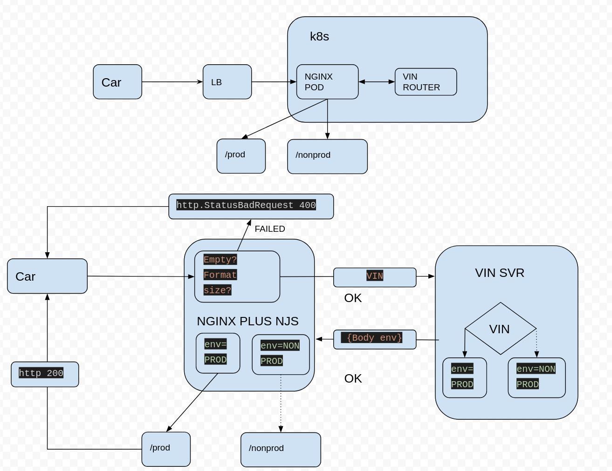
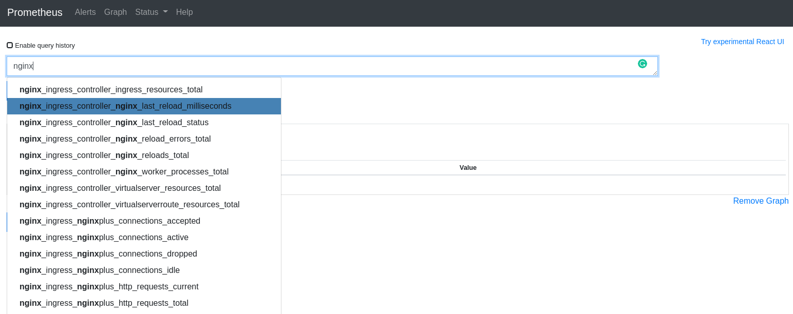
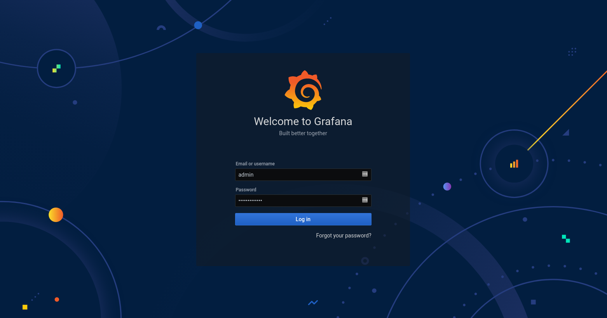
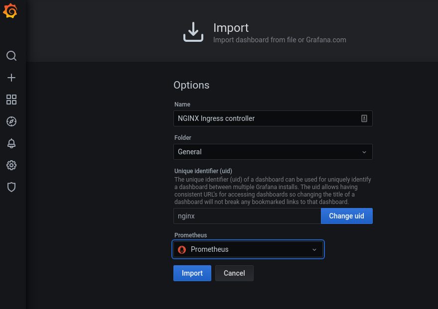
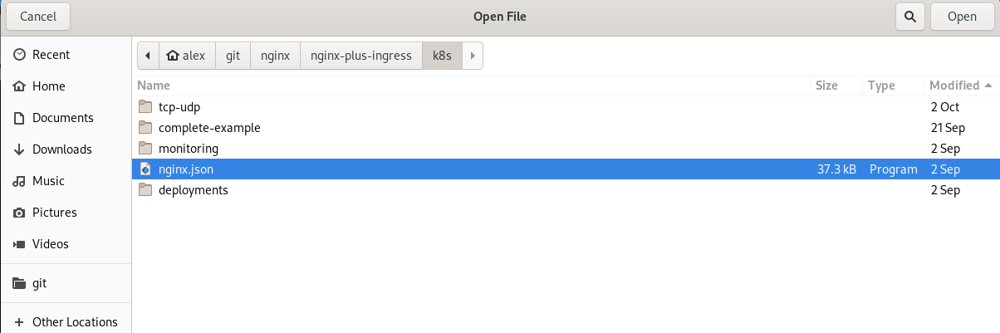

- [NGINX PLUS in K8s - Demos](#nginx-plus-in-k8s---demos)
  - [1. Clone repo](#1-clone-repo)
  - [2. Licenses](#2-licenses)
  - [3. Multinode Kubernetes cluster](#3-multinode-kubernetes-cluster)
    - [Deploy QBO Cluster](#deploy-qbo-cluster)
  - [4. Docker Registry](#4-docker-registry)
    - [Start](#start)
    - [Test](#test)
  - [5. Nginx Plus Docker Image](#5-nginx-plus-docker-image)
    - [Build](#build)
    - [Tag](#tag)
    - [Push](#push)
    - [Run in K8s](#run-in-k8s)
    - [Test](#test-1)
      - [Get NodePort](#get-nodeport)
      - [Get worker IPs](#get-worker-ips)
      - [Connect to NodePort](#connect-to-nodeport)
  - [6. Nginx Plus Ingress Docker Image](#6-nginx-plus-ingress-docker-image)
    - [Clone code](#clone-code)
    - [Checkout Specific Tag](#checkout-specific-tag)
    - [Licenses](#licenses)
    - [Build, Tag & Push](#build-tag--push)
    - [Run](#run)
    - [Test](#test-2)
      - [Get worker IP](#get-worker-ip)
      - [Test TCP Ingress](#test-tcp-ingress)
      - [Test UDP Ingress](#test-udp-ingress)
      - [Troubleshooting](#troubleshooting)
  - [7. Multiple Ingresses](#7-multiple-ingresses)
    - [Deploy](#deploy)
    - [OSS Nginx Ingress](#oss-nginx-ingress)
    - [Nginx Plus Ingress](#nginx-plus-ingress)
    - [Classes](#classes)
    - [Annotations](#annotations)
    - [Run app on specific ingress](#run-app-on-specific-ingress)
    - [Test](#test-3)
    - [Trobleshooting](#trobleshooting)
  - [8. NJS](#8-njs)
    - [Use Case](#use-case)
    - [Configuration](#configuration)
    - [Deploy demo](#deploy-demo)
    - [Test](#test-4)
  - [9. Mutual TLS](#9-mutual-tls)
    - [Deploy mTLS app](#deploy-mtls-app)
    - [Deploy Nginx Plus INgress configuration](#deploy-nginx-plus-ingress-configuration)
    - [Test](#test-5)
  - [10. Prometheus & Grafana](#10-prometheus--grafana)
    - [Install Helm](#install-helm)
    - [Create namespace monitoring](#create-namespace-monitoring)
    - [Install Prometheus Operator via Helm](#install-prometheus-operator-via-helm)
    - [Apply Prometheus and Grafana configs](#apply-prometheus-and-grafana-configs)
  - [Test](#test-6)
    - [Get worker node name](#get-worker-node-name)
    - [Get worker IP Adresss](#get-worker-ip-adresss)
    - [Add hosts entries](#add-hosts-entries)
    - [Access Prometheus UI](#access-prometheus-ui)
    - [Get grafana password](#get-grafana-password)
    - [Access Grafana UI](#access-grafana-ui)
  - [Add Nginx Plus Dashboard](#add-nginx-plus-dashboard)


# NGINX PLUS in K8s - Demos

## 1. Clone repo

```
git clone https://github.com/alexeadem/nginx-plus-demos.git
```

## 2. Licenses

```
cd nginx-plus-demos/licenses
```

> Copy your licenses under `licenses` and run `./validate-licenses.sh`

```
./validate-licenses.sh 
Certificate will not expire
in the next 15 days
Certifcate expiration [ OK ]
notBefore=Jul 30 12:20:00 2018 GMT
notAfter=Jul 27 12:20:00 2028 GMT
subject=C = RU, ST = Moscow, L = Moscow, O = NGINX Inc, OU = Client certificates, CN = A-S00072502
Certificate pair match [ OK ]
```


## 3. Multinode Kubernetes cluster

### Deploy QBO Cluster

```
qbo add cluster -w3 -p5000 -d`hostname`
[2020/10/02 14:32:28:0991] N:  master.d5540.eadem.com                        ready
[2020/10/02 14:33:30:1159] N:  worker-353c5fdc.d5540.eadem.com               ready
[2020/10/02 14:34:20:8543] N:  worker-03f50753.d5540.eadem.com               ready
[2020/10/02 14:35:22:7378] N:  worker-6e9bcb57.d5540.eadem.com               ready

kubectl get nodes
NAME                              STATUS   ROLES    AGE     VERSION
master.d5540.eadem.com            Ready    master   4m6s    v1.18.1-dirty
worker-03f50753.d5540.eadem.com   Ready    <none>   113s    v1.18.1-dirty
worker-353c5fdc.d5540.eadem.com   Ready    <none>   2m54s   v1.18.1-dirty
worker-6e9bcb57.d5540.eadem.com   Ready    <none>   61s     v1.18.1-dirty

qbo get nodes
c9a6532d01e6 worker-6e9bcb57.d5540.eadem.com          172.17.0.6         eadem/node:v1.18.1        running             
0924454fe5f1 worker-03f50753.d5540.eadem.com          172.17.0.5         eadem/node:v1.18.1        running             
60e28030e3de worker-353c5fdc.d5540.eadem.com          172.17.0.4         eadem/node:v1.18.1        running             
e60d01ebc96f master.d5540.eadem.com                   172.17.0.3         eadem/node:v1.18.1        running  

```


> For more details on the QBO installation go to: https://github.com/alexeadem/qbo-ctl


## 4. Docker Registry

### Start
```
kubectl apply -f https://raw.githubusercontent.com/alexeadem/qbo-ctl/master/conf/registry.yaml
persistentvolumeclaim/registry-data created
persistentvolume/registry-data created
replicationcontroller/registry created
service/registry created
```

### Test

```
curl localhost:5000/v2/_catalog
{"repositories":[]}
```


## 5. Nginx Plus Docker Image

### Build
```
docker build -t nginx-plus:22-r1 --build-arg version=22-r1 -f nginx-plus/Dockerfile .
```
### Tag
```
docker tag nginx-plus:22-r1 localhost:5000/nginx-plus:22-r1
```
### Push
```
docker push localhost:5000/nginx-plus:22-r1
```

### Run in K8s 

```
kubectl apply -f nginx-plus/k8s
```
### Test
```
kubectl get pods
NAME                                   READY   STATUS    RESTARTS   AGE
nginx-plus-c7958bcd6-85dr4             1/1     Running   3          101s
nginx-plus-upstream-6778787f99-vwmrg   1/1     Running   0          101s
```
#### Get NodePort
```
kubectl get svc
NAME                  TYPE        CLUSTER-IP       EXTERNAL-IP   PORT(S)                      AGE
kubernetes            ClusterIP   172.16.0.1       <none>        443/TCP                      12m
nginx-plus            NodePort    172.16.143.152   <none>        80:30080/TCP,443:30443/TCP   2m10s
nginx-plus-upstream   ClusterIP   None             <none>        <none>                       2m10s
```
#### Get worker IPs
```
qbo get nodes
c9a6532d01e6 worker-6e9bcb57.d5540.eadem.com          172.17.0.6         eadem/node:v1.18.1        running             
0924454fe5f1 worker-03f50753.d5540.eadem.com          172.17.0.5         eadem/node:v1.18.1        running             
60e28030e3de worker-353c5fdc.d5540.eadem.com          172.17.0.4         eadem/node:v1.18.1        running             
e60d01ebc96f master.d5540.eadem.com                   172.17.0.3         eadem/node:v1.18.1        running  
```
#### Connect to NodePort 
```
curl 172.17.0.4:30080
Status code: 200
Server address: 192.168.6.193:8096
Server name: nginx-plus-upstream-6778787f99-vwmrg
Date: 02/Oct/2020:14:45:17 $0000
User-Agent: curl/7.69.1
Cookie: 
URI: /
Request ID: 779da9d538851beb1d30bbf66db19704

```

## 6. Nginx Plus Ingress Docker Image


### Clone code
```
cd ..
git clone https://github.com/nginxinc/kubernetes-ingress.git
```
### Checkout Specific Tag
```
cd kubernetes-ingress
git checkout tags/v1.9.0
```
### Licenses
```
cp licenses/nginx-repo.crt licenses/nginx-repo.key ../kubernetes-ingress/
cd ../kubernetes-ingress/
```
### Build, Tag & Push
```
make DOCKERFILE=DockerfileForPlus VERSION=v1.9.0 PREFIX=localhost:5000/nginx-plus-ingress
```

### Run
```
kubectl create namespace nginx-ingress
kubectl apply -f nginx-plus-ingress/k8s/deployments/rbac/rbac.yaml
kubectl apply -f nginx-plus-ingress/k8s/deployments/common/ns-and-sa.yaml
kubectl apply -f nginx-plus-ingress/k8s/deployments/common/nginx-config.yaml
kubectl apply -f nginx-plus-ingress/k8s/deployments/common/ts-definition.yaml
kubectl apply -f nginx-plus-ingress/k8s/deployments/common/vs-definition.yaml
kubectl apply -f nginx-plus-ingress/k8s/deployments/common/vsr-definition.yaml
kubectl apply -f nginx-plus-ingress/k8s/deployments/common/policy-definition.yaml
kubectl apply -f nginx-plus-ingress/k8s/deployments/common/ingress-class.yaml
kubectl apply -f nginx-plus-ingress/k8s/deployments/common/default-server-secret.yaml
kubectl apply -f nginx-plus-ingress/k8s/deployments/deployment/nginx-plus-ingress.yaml
kubectl apply -f nginx-plus-ingress/k8s/tcp-udp/nginx-plus-config.yaml
```
### Test

```
kubectl get pods -n nginx-ingress  -o wide 
NAME                             READY   STATUS    RESTARTS   AGE   IP                NODE                              NOMINATED NODE   READINESS GATES
nginx-ingress-7f9d695cbd-8ctv5   1/1     Running   0          52s   192.168.150.135   worker-353c5fdc.d5540.eadem.com   <none>          
```
> Note that the the ingress is running in worker node `worker-6e9bcb57.d5540.eadem.com`. 

#### Get worker IP

```
qbo get nodes
c9a6532d01e6 worker-6e9bcb57.d5540.eadem.com          172.17.0.6         eadem/node:v1.18.1        running             
0924454fe5f1 worker-03f50753.d5540.eadem.com          172.17.0.5         eadem/node:v1.18.1        running             
60e28030e3de worker-353c5fdc.d5540.eadem.com          172.17.0.4         eadem/node:v1.18.1        running             
e60d01ebc96f master.d5540.eadem.com 
```
#### Test TCP Ingress

```

curl  172.17.0.3:5000/v2/_catalog
{"repositories":["nginx-plus","nginx-plus-ingress"]}

```

> Relevant ConfigMap `nginx-plus-ingress/k8s/tcp-udp/nginx-plus-config.yaml`

```
      upstream registry-tcp {
          zone registry-tcp 64k;
          server registry.kube-system.svc.cluster.local:5000 resolve;
      }

      server {
          listen 5000;
          proxy_pass registry-tcp;
          status_zone registry-tcp;
      } 
```

#### Test UDP Ingress

```
nslookup registry.kube-system.svc.cluster.local 172.17.0.3
Server:         172.17.0.3
Address:        172.17.0.3#53

Name:   registry.kube-system.svc.cluster.local
Address: 172.16.69.112

```
> Relevant ConfigMap `nginx-plus-ingress/k8s/tcp-udp/nginx-plus-config.yaml`


```
      upstream coredns-udp {
          zone coredns-udp 64k;
          server kube-dns.kube-system.svc.cluster.local:53 resolve;
      }

      server {
          listen 53 udp;
          proxy_pass coredns-udp;
          proxy_responses 1;
          status_zone coredns-udp;
      }

```

#### Troubleshooting

```
kubectl logs -f -lapp=nginx-ingress -n nginx-ingress

```

## 7. Multiple Ingresses 

In this demo you'll be running two ingresses. The OSS nginx ingress and the nginx plus ingress. The nginx OSS ingress will be running in the master and the nginx plus ingress will be running in one of the worker nodes. Both ingress will be using different namespaces.

### Deploy

Deploy Nginx Plus Ingress. Follow step 6.

```
kubectl get pods -n nginx-ingress -o wide
NAME                             READY   STATUS    RESTARTS   AGE    IP                NODE                              NOMINATED NODE   READINESS GATES
nginx-ingress-7f9d695cbd-8ctv5   1/1     Running   0          125m   192.168.150.135   worker-353c5fdc.d5540.eadem.com   <none>           <none>
```

### OSS Nginx Ingress

```
kubectl get pods -lapp.kubernetes.io/component=controller -n ingress-nginx -o wide
NAME                                        READY   STATUS    RESTARTS   AGE     IP               NODE                     NOMINATED NODE   READINESS GATES
ingress-nginx-controller-679d8fd6f6-d2zwv   1/1     Running   0          3h13m   192.168.43.196   master.d5540.eadem.com   <none>           <none>
```

You can see that the OSS nginx ingress is running in the master node `master.d5540.eadem.com `

```$ qbo get nodes
c9a6532d01e6 worker-6e9bcb57.d5540.eadem.com          172.17.0.6         eadem/node:v1.18.1        running             
0924454fe5f1 worker-03f50753.d5540.eadem.com          172.17.0.5         eadem/node:v1.18.1        running             
60e28030e3de worker-353c5fdc.d5540.eadem.com          172.17.0.4         eadem/node:v1.18.1        running             
e60d01ebc96f master.d5540.eadem.com                   172.17.0.3         eadem/node:v1.18.1        running
```

and ip  `172.17.0.3`

> The following configuration is used in the deployment to run the ingress in the master node.

```
      nodeSelector:
        ingress-ready: 'true'
      tolerations:
        - effect: NoSchedule
          key: node-role.kubernetes.io/master
          operator: Equal
```
### Nginx Plus Ingress

```
kubectl get pods -n nginx-ingress -o wide
NAME                             READY   STATUS    RESTARTS   AGE    IP                NODE                              NOMINATED NODE   READINESS GATES
nginx-ingress-7f9d695cbd-8ctv5   1/1     Running   0          137m   192.168.150.135   worker-353c5fdc.d5540.eadem.com   <none>           <none>
```

And you can see that nginx plus ingress is running in worker node `worker-353c5fdc.d5540.eadem.com`

and ip `172.17.0.4`


### Classes
In order you using multiple ingress you need to define classes. In `nginx-plus-ingress/k8s/deployments/deployment/nginx-plus-ingress.yaml`, you can see the following

```
        args:
          - -ingress-class=plus
          - -use-ingress-class-only
```

The first argument `-ingress-class=plus` tells nginx plus ingress be assigned to the `plus` class. And the second one `-use-ingress-class-only` tell nginx plus ingress to take only ingresses with `plus` configuration class.

> For more info on classes: `https://docs.nginx.com/nginx-ingress-controller/installation/running-multiple-ingress-controllers/`

### Annotations

In order the use the nginx plus ingress the following annotation will need to be added

```
metadata:
  annotations:
    kubernetes.io/ingress.class: "plus"
```
> See `nginx-plus-ingress/k8s/complete-example/cafe.yaml` for configuration
> If no annotation is added the OSS nginx will pick up the ingress

### Run app on specific ingress

```
kubectl apply -f nginx-plus-ingress/k8s/complete-example
```

### Test

Check that your test app is running

```
kubectl get pods
NAME                                   READY   STATUS    RESTARTS   AGE
coffee-5f56ff9788-qfn4m                1/1     Running   0          60s
coffee-5f56ff9788-t9bkz                1/1     Running   0          60s
nginx-plus-c7958bcd6-85dr4             1/1     Running   3          3h46m
nginx-plus-upstream-6778787f99-vwmrg   1/1     Running   0          3h46m
tea-69c99ff568-4jjz7                   1/1     Running   0          60s
tea-69c99ff568-bn5j5                   1/1     Running   0          60s
tea-69c99ff568-mt8k4                   1/1     Running   0          60s
```

```
kubectl get pod -lapp=nginx-ingress -n nginx-ingress -o wide
NAME                             READY   STATUS    RESTARTS   AGE    IP                NODE                              NOMINATED NODE   READINESS GATES
nginx-ingress-7f9d695cbd-8ctv5   1/1     Running   0          177m   192.168.150.135   worker-353c5fdc.d5540.eadem.com   <none>           <none>
```

```
qbo get nodes
c9a6532d01e6 worker-6e9bcb57.d5540.eadem.com          172.17.0.6         eadem/node:v1.18.1        running             
0924454fe5f1 worker-03f50753.d5540.eadem.com          172.17.0.5         eadem/node:v1.18.1        running             
60e28030e3de worker-353c5fdc.d5540.eadem.com          172.17.0.4         eadem/node:v1.18.1        running             
e60d01ebc96f master.d5540.eadem.com                   172.17.0.3         eadem/node:v1.18.1        running  
```

The ingress is running in worker node `worker-353c5fdc.d5540.eadem.com` with IP `172.17.0.4`

And finally test the nginx plus ingress

```
curl https://cafe.example.com/coffee -k --resolve cafe.example.com:443:172.17.0.4
Server address: 192.168.14.4:8080
Server name: coffee-5f56ff9788-t9bkz
Date: 02/Oct/2020:18:34:52 +0000
URI: /coffee
Request ID: 4867ceb1d1d153a3fbd4487ce5af1f4b
```

> Note that if you try the other ingress running in the master node the request will fail

```
curl https://cafe.example.com/coffee -k --resolve cafe.example.com:443:172.17.0.3
<html>
<head><title>404 Not Found</title></head>
<body>
<center><h1>404 Not Found</h1></center>
<hr><center>nginx/1.17.10</center>
</body>
</html>
```

### Trobleshooting

Once you deploy the ingress you should see that the cafe ingress has been picked up and added by the right nginx plus ingress

```
kubectl logs -f nginx-ingress-7f9d695cbd-8ctv5 -n nginx-ingress
```

```
I1002 18:28:22.811121       1 event.go:278] Event(v1.ObjectReference{Kind:"Ingress", Namespace:"default", Name:"cafe-ingress", UID:"b6bd8d64-8255-492b-a930-108175b503ef", APIVersion:"extensions/v1beta1", ResourceVersion:"38662", FieldPath:""}): type: 'Normal' reason: 'AddedOrUpdated' Configuration for default/cafe-ingress was added or updated
```

## 8. NJS

### Use Case 




This demo simulates communication between cars (clients) sending their VINs numbers to Nginx Plus for routing to a specific backend: Either DEV or PROD. Nginx will receive the car request and pass it to a VIN Router which will set
the specific environment based on the VIN number in the `body` response back to Nginx Plus. Using NJS Nginx Plus will parse the environment variable `Env` and proxy the car request to either PROD or DEV.

### Configuration

> Note `apk add nginx-plus-module-njs` is added in Dockerfile. And `load_module modules/ngx_http_js_module.so;` in `nginx-plus/etc/nginx/nginx.conf`. Adding the module when building the image and enabling it in the configuration is required in order to use NJS.

Relevant config `njs/nginx-plus-conf-d.yaml`

```

    js_import conf.d/vinrouter.js;

    map $http_CCRT_Subject $ccrtSubject {
        "" "";      # is empty
        default 1;  # not empty
    }

    # Check CN value in CCRT-Subject Header exists and
    # set $ccrtSubject_vin to the value CN
    # e.g. CN=xxxxxxxxxxxxx

    map $http_CCRT_Subject $ccrtSubject_vin {
        default "";      # is empty
        # Case senstive (~) matching
        "~CN=(?<vin>[0-9A-Z]+)[,/]?" $vin;  # not empty
    }

    map $route $upstream {
        default         production;
        PROD            production;
        DEV             dev;
    }

    # nginx.local HTTP
    server {
        listen 80 default_server;
        server_name nginx.local "";
        status_zone nginx.local_http;

        proxy_intercept_errors on;     # Do not send backend errors to the client
        default_type application/json; # If no content-type then assume JSON

        error_log  /var/log/nginx/error.log  debug;


        location / {


            auth_request /get_env_trampoline;
            auth_request_set $route $sent_http_env;

            if ($ccrtSubject_vin = "") {
                return 400;
            }

            proxy_pass_request_body on;
            add_header X-Body $request_body;
            proxy_pass http://$upstream;

        }

        location = /get_env_trampoline {
            internal;
            proxy_pass http://127.0.0.1:8001/get_env;
            proxy_pass_request_body off;
            proxy_set_header Content-Length "";
        }

  ```

### Deploy demo

`kubectl apply -f njs`

### Test 

Test Prod
> Adding a letter in front of the VIN will route to PROD
```
curl  http://nginx.local/web-services/user-data/1.1/auto-get-profiles-timestamp -H 'CCRT-Subject: C=DE, O=Daimler AG, OU=MBIIS-CERT, CN=ADF4477' --resolve nginx.local:80:172.17.0.3
{
            "environment": "production"
            }
```

Test Dev
> Adding a number in front of the VIN will route to DEV

```
curl  http://nginx.local/web-services/user-data/1.1/auto-get-profiles-timestamp -H 'CCRT-Subject: C=DE, O=Daimler AG, OU=MBIIS-CERT, CN=0DF4477' --resolve nginx.local:80:172.17.0.3
{
            "environment": "dev"
            }
```

## 9. Mutual TLS

> Please note that  nginx-ingress > v1.9.0 and  and k8s version > v1.10.0 are needed for this demo.

If you haven't already done it, follow section `6` of this guide to build, ship, and run the Nginx Plus Ingress docker image.


### Deploy mTLS app

```
kubectl apply -f nginx-plus-ingress/k8s/ingress-mtls/webapp.yaml
```
### Deploy Nginx Plus INgress configuration
```
kubectl apply -f nginx-plus-ingress/k8s/ingress-mtls/ingress-mtls-secret.yaml
kubectl apply -f nginx-plus-ingress/k8s/ingress-mtls/ingress-mtls.yaml
kubectl apply -f nginx-plus-ingress/k8s/ingress-mtls/tls-secret.yaml
kubectl apply -f nginx-plus-ingress/k8s/ingress-mtls/virtual-server.yam
```

### Test

Get ingress worker node

```
kubectl get pods -lapp=nginx-ingress -n nginx-ingress -o wide
NAME                             READY   STATUS    RESTARTS   AGE   IP                NODE                              NOMINATED NODE   READINESS GATES
nginx-ingress-6cb66fc868-q6x5k   1/1     Running   0          10m   192.168.142.142   worker-97c3e840.d5540.eadem.com   <none>           <none>
```

Get worker node IP
```
qbo get nodes
cdc491667798 worker-7224a7a4.d5540.eadem.com          172.17.0.5         eadem/node:v1.18.1        running             
412c34fbe2a7 worker-97c3e840.d5540.eadem.com          172.17.0.4         eadem/node:v1.18.1        running             
e2186bca311a master.d5540.eadem.com                   172.17.0.3         eadem/node:v1.18.1        running
```

Test without client certs

```
curl --insecure --resolve webapp.example.com:443:172.17.0.4 https://webapp.example.com:443/
<html>
<head><title>400 No required SSL certificate was sent</title></head>
<body>
<center><h1>400 Bad Request</h1></center>
<center>No required SSL certificate was sent</center>
<hr><center>nginx/1.19.0</center>
</body>
</html>
```

Test using client certs
```
curl --insecure --resolve webapp.example.com:443:172.17.0.4 https://webapp.example.com:443/ --cert nginx-plus-ingress/k8s/ingress-mtls/client-cert.pem --key nginx-plus-ingress/k8s/ingress-mtls/client-key.pem
Server address: 192.168.2.206:8080
Server name: webapp-d55c6448-92twn
Date: 21/Oct/2020:12:45:52 +0000
URI: /
Request ID: 64acd047e4daea9bc2ea26511f4aceba
```

## 10. Prometheus & Grafana

### Install Helm
```
curl https://raw.githubusercontent.com/helm/helm/master/scripts/get-helm-3 > get_helm.sh
chmod 700 get_helm.sh 
./get_helm.sh 
helm repo add stable https://charts.helm.sh/stable --force-update
helm repo update
```

### Create namespace monitoring
```
kubectl create namespace monitoring
```

### Install Prometheus Operator via Helm
```
helm install prometheus-operator --namespace monitoring stable/prometheus-operator --set prometheus.prometheusSpec.serviceMonitorSelectorNilUsesHelmValues=false --set grafana.sidecar.dashboards.enabled=true
watch kubectl --namespace default get pods --namespace=monitoring 
```
> When you see all components up, CTRL-C out of it.
> 
### Apply Prometheus and Grafana configs
```
kubectl apply -f nginx-plus-ingress/k8s/monitoring/
```
## Test

### Get worker node name
```
kubectl get pods -n nginx-ingress -o wide
NAME                             READY   STATUS    RESTARTS   AGE   IP             NODE                              NOMINATED NODE   READINESS GATES
nginx-ingress-6b447c88b7-brk7r   1/1     Running   0          20m   192.168.57.4   worker-1b96d796.d5540.eadem.com   <none>           <none>
```

### Get worker IP Adresss

```
qbo get nodes 
7266b3a4bd78 worker-2a950333.d5540.eadem.com          172.17.0.6         eadem/node:v1.18.1        running             
d0a187d31f30 worker-209e83a9.d5540.eadem.com          172.17.0.5         eadem/node:v1.18.1        running             
98df45ed1d07 worker-1b96d796.d5540.eadem.com          172.17.0.4         eadem/node:v1.18.1        running             
e147cbf0cda2 master.d5540.eadem.com                   172.17.0.3         eadem/node:v1.18.1        running  

```
### Add hosts entries

Add to `/etc/hosts/`

```
172.17.0.4      grafana.example.com
172.17.0.4      prometheus.example.com
172.17.0.4      alertmanager.example.com
```

### Access Prometheus UI

Open `http://prometheus.example.com/graph` using your web browser



### Get grafana password

```
kubectl get secret -n monitoring prometheus-operator-grafana -o jsonpath="{.data.admin-password}" | base64 --decode ; echo

```
### Access Grafana UI

Open `http://grafana.example.com/login` using your web browser

and user `admin` and the password obtained in the previous section



## Add Nginx Plus Dashboard








